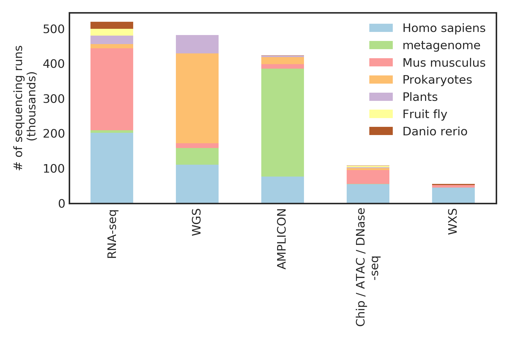

# In short:
Skymap is a database that offers: 
1. a single data matrix for each omic layer for each specie that spans >200k sequencing runs from all the public studies, which is done by reprocessing Peta-bytes worth of sequencing data. 


2. a metadata file that describe the relationships between the sequencing runs and also the keywords extracted from freetext annotations. 

The data is hosted in here: https://www.synapse.org/skymap (take < 3 minutes to set up the account). Code is hosted in github, the jupyer-notebooks aim to show analysis examples of going from data slicing to hypothesis testing). 


# In long: 
## Motivation: Pooling processed data from multiple studies is time-consuming: 
When I first started in bioinformatic couple years ago, I spent much of my time doing two things: 1.) cleaning omic data matrices, e.g. mapping between gene IDs (hgnc, enseml, ucsc, etc.) for processed data matrices, trying all sort of different bioinformatics pipelines that yield basically the same results, investigating what is the exact unit being counted over when pulling data from public database, etc.  2.) cleaning metadata annotation, which usually involves extracting and aliasing the labels to the exact same categories. 

This question came to my mind: Can we merge and reduce the peta-bytes worth of public omic data in a table while capturing the commonly used information that can fit into your hard drive (<500 GB), like firehose for TCGA data? 

## Solution: An automated pipeline to generate a single data matrix that does simple counting for each specie and omic layer 
What I am offering in here is a metadata table and a single data matrix for each omic layer that encapsulate majority of the public data out there. I do believe that “Science started with counting” (from “Cancer: Emperor of all malady” by Siddhartha Mukherjee), and thus I offer raw counts for all the features: 1. ) the  base resolution ACGT counts for over 200k experiments among NCBI curated SNPs, where read depth and allelic fraction are usually the main drivers for SNP calling. We also offer an expression matrix, where most counts at both transcript and gene resolution, where most normalization can be done post-hoc. 
The metadata table consists of controlled vocabulary (NCI Terminology) from free text annotations of each experiment. I used the NLM metamap engine for this purpose. The nice thing is that the UMLS ecosystem from NLM allow the IDs (Concept Unique Identifiers) to be mapped onto different ontology hierarchy to relate the terms. 
The pipeline in here is trying to suit the needs of the common use cases. In another word, most pipelines out there are more like sport cars, having custom flavors for a specific group of drivers. What I am trying to create is more like a train system, aiming to suit most needs. Unfortunately, if you have more specific requirements, what I am offering is probably not going to work. 

Benchmark: 
https://github.com/brianyiktaktsui/Skymap/blob/master/jupyter-notebooks/clean_notebooks/CompareTCGA_alignment_w_mine_pipe.ipynb

## Why Skymap while there are so many groups out there also trying to unify the public data
To the best of my knowledge, Skymap is the first that offer both the unified omic data and cleaned metadata. The other important aspect is that the process of data extraction is fully automated, so it is supposed to be scalable.  
Data format and coding style:
I tried to keep the code and parameters to be lean and self-explanatory for your reference, but most of the scripts I wrote are far from the industrial standard. 
The storage is in python pandas pickle format. The ecosystem in python appears to be much better at handling large dataset while offering intuitive coding interfaces. For now, Skymap is geared towards ML/data science folks who are hungry for the vast amount of data and ain’t afraid of coding.

Skymap is still in Beta V0.0. [Please feel free to leave comments](https://www.synapse.org/#!Synapse:syn11415602/discussion/default) and suggestions!!! We would love to hear feedbacks from you.
## Acknowledgement

In terms of validation of allelic alignment, we compared against TCGA as gold standard. 

Please considering citing if you are using Skymap. (doi:10.7303/syn11415602)
Acknowledgement: We want to thank for the advice and resources from Dr. Hannah Carter, Dr. Jill Mesirove,Dr. Trey Ideker and Shamin Mollah. We also want to thank Dr. Ruben Arbagayen, Dr. Nate Lewis for their suggestion.
The method will soon be posted in bioarchive. Also, we want to thank the Sage Bio Network for hosting the data.
Term of use: Use Skymap however you want. Just don't sue me, I have no money.


  
# Purpose of this notebook:  using skymap to slice out the sequencing runs associated with a BRAF V600 mutation and correlate it with expression (EQTL). 

Highlights:
* Take only seconds to slicing all the allelic read counts for the samples with data near BRAF V600 position.  
* Identify associations using NLP extracted labels from experimental annotations
* Take < 1 minute to slice out the relevant expression matrix and associate with expression. 
* identify experiemnts where mutation is shown in molecular data but not in the text annotation. 


##  <20 lines of code to slice out 100k experiments and their SNP near BRAF V600 in seconds


```python
### parameters
import pandas as pd
import numpy as np
mySpecie='Homo_sapiens'
skymap_snp_dir='/cellar/users/btsui/Data/SRA/snp/{specie}_snp_pos/'.format(specie=mySpecie)
```

### BRAF V600 coordinate 


```python
#location where BRAF V600 happens, you can change it to whatever position you want 
#http://cancer.sanger.ac.uk/cosmic/mutation/overview?id=476
queryChr,queryPosition='7',140753336 
```


```python
window=15
readThreshold=5
```

static code for slicing out the data


```python
%%time
chunkSize=100000 #fixed params
myChunk=(queryPosition/chunkSize)*chunkSize
hdf_s=pd.HDFStore(skymap_snp_dir+'Pos_block_'+str(myChunk),mode='r')
tmpChunkDf=hdf_s['/chunk']
myPosDf=tmpChunkDf[(tmpChunkDf.Pos>=(queryPosition-window))&(tmpChunkDf.Pos<=(queryPosition+window))].reset_index()
m1=myPosDf['Chr']==queryChr
m2=myPosDf['ReadDepth']>=readThreshold
myChrPosDf=myPosDf[m1&m2]
```

    CPU times: user 584 ms, sys: 256 ms, total: 840 ms
    Wall time: 3.25 s


```python
print '# of studies sliced out:' ,tmpChunkDf.Run_digits.nunique()
```

    # of studies sliced out: 149064


### the slice out the window at around BRAF V600


```python
myChrPosDf.head()
```


<div>
<style>
    .dataframe thead tr:only-child th {
        text-align: right;
    }

    .dataframe thead th {
        text-align: left;
    }

    .dataframe tbody tr th {
        vertical-align: top;
    }
</style>
<table border="1" class="dataframe">
  <thead>
    <tr style="text-align: right;">
      <th>features</th>
      <th>Chr</th>
      <th>base</th>
      <th>Run_db</th>
      <th>Run_digits</th>
      <th>Pos</th>
      <th>ReadDepth</th>
      <th>AverageBaseQuality</th>
      <th>block</th>
    </tr>
  </thead>
  <tbody>
    <tr>
      <th>2</th>
      <td>7</td>
      <td>C</td>
      <td>SRR</td>
      <td>1177675</td>
      <td>140753321</td>
      <td>9</td>
      <td>39</td>
      <td>140700000</td>
    </tr>
    <tr>
      <th>3</th>
      <td>7</td>
      <td>C</td>
      <td>SRR</td>
      <td>4444531</td>
      <td>140753321</td>
      <td>5</td>
      <td>40</td>
      <td>140700000</td>
    </tr>
    <tr>
      <th>6</th>
      <td>7</td>
      <td>C</td>
      <td>SRR</td>
      <td>5882370</td>
      <td>140753321</td>
      <td>39</td>
      <td>39</td>
      <td>140700000</td>
    </tr>
    <tr>
      <th>9</th>
      <td>7</td>
      <td>C</td>
      <td>SRR</td>
      <td>5111728</td>
      <td>140753321</td>
      <td>5</td>
      <td>39</td>
      <td>140700000</td>
    </tr>
    <tr>
      <th>17</th>
      <td>7</td>
      <td>C</td>
      <td>SRR</td>
      <td>2125816</td>
      <td>140753321</td>
      <td>5</td>
      <td>37</td>
      <td>140700000</td>
    </tr>
  </tbody>
</table>
</div>


### combine with reference base

###### find reference base for each chrosome coordinate


```python

inVcfDir='/data/cellardata/users/btsui/dbsnp/All_20170710.f1_byte2_not_00.vcf.gz' 
vcfDf=pd.read_csv(inVcfDir,sep='\t',header=None)
vcfDf.columns=['Chr','Pos','RsId','RefBase','AltBase','','','Annot']
vcfDf['Chr']=vcfDf['Chr'].astype(np.str)
my_chrom_vcfDf=vcfDf[(vcfDf['Chr']==queryChr)]
posToRefBase=my_chrom_vcfDf.set_index('Pos')['RefBase']
posToRefBase=posToRefBase.str[0]
posToRefBase=posToRefBase.groupby(posToRefBase.index).first()

```

### visualize for the BRAFV600 mutated samples

Since human sequencing data are mostly generated from cell lines, we expect the cells measured often come with a highly  specifc oncogeneic transformation, thus we should observe a overpresenation of data with BRAFV600 as compared to its immediate neighboring regions, as shown in the following figure.


```python

### recover reference base
myChrPosDf['RefBase']=posToRefBase.loc[myChrPosDf['Pos']].values
### is base alt?
myChrPosDf['AltBase']=myChrPosDf['RefBase']!=myChrPosDf['base']
#### consider dropping duplciates of Runs (a runs can have multiple bases) 
myPosCountDf=myChrPosDf.groupby(['Pos','AltBase']).size()
```

    /cellar/users/btsui/anaconda2/lib/python2.7/site-packages/ipykernel_launcher.py:3: SettingWithCopyWarning: 
    A value is trying to be set on a copy of a slice from a DataFrame.
    Try using .loc[row_indexer,col_indexer] = value instead
    
    See the caveats in the documentation: http://pandas.pydata.org/pandas-docs/stable/indexing.html#indexing-view-versus-copy
      This is separate from the ipykernel package so we can avoid doing imports until
    /cellar/users/btsui/anaconda2/lib/python2.7/site-packages/ipykernel_launcher.py:5: SettingWithCopyWarning: 
    A value is trying to be set on a copy of a slice from a DataFrame.
    Try using .loc[row_indexer,col_indexer] = value instead
    
    See the caveats in the documentation: http://pandas.pydata.org/pandas-docs/stable/indexing.html#indexing-view-versus-copy
      """


```python
inDf=myPosCountDf.unstack()
fractionDf=(inDf.T/inDf.sum(axis=1)).T
```


```python
%matplotlib inline
import matplotlib.pyplot as plt
fig,ax=plt.subplots()
ax.scatter(x=fractionDf.index,y=fractionDf[True],label='dbSNPs from neighboring regions')
queryDf=fractionDf[fractionDf.index==queryPosition]
ax.scatter(x=[queryPosition],y=fractionDf.loc[[queryPosition]][True],label='SNP at BRAF V600')
ax.set_ylabel('% seq runs with alternative allele')
ax.set_xlabel('Genomic positions near BRAF V600')
ax.legend()
ax.set_xticklabels([])
```


    []


### BRAF V600 mutation are measured and exracted from many different data layers

as show in the following figure


```python
altBaseDf=myChrPosDf[(myChrPosDf['Pos']==queryPosition)&(myChrPosDf['AltBase'])]
```


```python
altBaseDf=altBaseDf.set_index(['Run_db','Run_digits'])
```

### load in technical meta data

For more information about the aliases used in the follow meta data:

https://www.ncbi.nlm.nih.gov/books/NBK56913/


```python
sra_dump_pickle_dir='/cellar/users/btsui/Data/SRA/DUMP/sra_dump.pickle'

technical_meta_data_df=pd.read_pickle(sra_dump_pickle_dir)
```


```python
technical_meta_data_df.shape
```


    (3763299, 22)


```python
technical_meta_data_df.head()
```


<div>
<style>
    .dataframe thead tr:only-child th {
        text-align: right;
    }

    .dataframe thead th {
        text-align: left;
    }

    .dataframe tbody tr th {
        vertical-align: top;
    }
</style>
<table border="1" class="dataframe">
  <thead>
    <tr style="text-align: right;">
      <th></th>
      <th>Member_Name</th>
      <th>Experiment</th>
      <th>Sample</th>
      <th>Study</th>
      <th>Spots</th>
      <th>Bases</th>
      <th>Status</th>
      <th>ScientificName</th>
      <th>LibraryStrategy</th>
      <th>LibraryLayout</th>
      <th>...</th>
      <th>proj_accession_Updated</th>
      <th>proj_accession_Published</th>
      <th>proj_accession_Received</th>
      <th>proj_accession_Type</th>
      <th>proj_accession_Center</th>
      <th>proj_accession_Visibility</th>
      <th>proj_accession_Loaded</th>
      <th>proj_accession_ReplacedBy</th>
      <th>Run_db</th>
      <th>Run_digits</th>
    </tr>
    <tr>
      <th>Run</th>
      <th></th>
      <th></th>
      <th></th>
      <th></th>
      <th></th>
      <th></th>
      <th></th>
      <th></th>
      <th></th>
      <th></th>
      <th></th>
      <th></th>
      <th></th>
      <th></th>
      <th></th>
      <th></th>
      <th></th>
      <th></th>
      <th></th>
      <th></th>
      <th></th>
    </tr>
  </thead>
  <tbody>
    <tr>
      <th>SRR2401865</th>
      <td>default</td>
      <td>SRX1244330</td>
      <td>SRS1068422</td>
      <td>-</td>
      <td>2800.0</td>
      <td>1416405.0</td>
      <td>live</td>
      <td>soil_metagenome</td>
      <td>AMPLICON</td>
      <td>SINGLE</td>
      <td>...</td>
      <td>2015-09-22</td>
      <td>2015-09-20</td>
      <td>2015-09-15</td>
      <td>RUN</td>
      <td>SUB1095135</td>
      <td>public</td>
      <td>1</td>
      <td>-</td>
      <td>SRR</td>
      <td>2401865</td>
    </tr>
    <tr>
      <th>SRR2401866</th>
      <td>default</td>
      <td>SRX1244331</td>
      <td>SRS1068421</td>
      <td>-</td>
      <td>5082.0</td>
      <td>2563605.0</td>
      <td>live</td>
      <td>soil_metagenome</td>
      <td>AMPLICON</td>
      <td>SINGLE</td>
      <td>...</td>
      <td>2015-09-22</td>
      <td>2015-09-20</td>
      <td>2015-09-15</td>
      <td>RUN</td>
      <td>SUB1095135</td>
      <td>public</td>
      <td>1</td>
      <td>-</td>
      <td>SRR</td>
      <td>2401866</td>
    </tr>
    <tr>
      <th>SRR2401867</th>
      <td>default</td>
      <td>SRX1244332</td>
      <td>SRS1068420</td>
      <td>-</td>
      <td>6169.0</td>
      <td>3175528.0</td>
      <td>live</td>
      <td>soil_metagenome</td>
      <td>AMPLICON</td>
      <td>SINGLE</td>
      <td>...</td>
      <td>2015-09-22</td>
      <td>2015-09-20</td>
      <td>2015-09-15</td>
      <td>RUN</td>
      <td>SUB1095135</td>
      <td>public</td>
      <td>1</td>
      <td>-</td>
      <td>SRR</td>
      <td>2401867</td>
    </tr>
    <tr>
      <th>SRR2401868</th>
      <td>default</td>
      <td>SRX1244333</td>
      <td>SRS1068419</td>
      <td>-</td>
      <td>8102.0</td>
      <td>4266915.0</td>
      <td>live</td>
      <td>soil_metagenome</td>
      <td>AMPLICON</td>
      <td>SINGLE</td>
      <td>...</td>
      <td>2015-09-22</td>
      <td>2015-09-20</td>
      <td>2015-09-15</td>
      <td>RUN</td>
      <td>SUB1095135</td>
      <td>public</td>
      <td>1</td>
      <td>-</td>
      <td>SRR</td>
      <td>2401868</td>
    </tr>
    <tr>
      <th>SRR2401869</th>
      <td>default</td>
      <td>SRX1244334</td>
      <td>SRS1068418</td>
      <td>-</td>
      <td>4971.0</td>
      <td>2519200.0</td>
      <td>live</td>
      <td>soil_metagenome</td>
      <td>AMPLICON</td>
      <td>SINGLE</td>
      <td>...</td>
      <td>2015-09-22</td>
      <td>2015-09-20</td>
      <td>2015-09-15</td>
      <td>RUN</td>
      <td>SUB1095135</td>
      <td>public</td>
      <td>1</td>
      <td>-</td>
      <td>SRR</td>
      <td>2401869</td>
    </tr>
  </tbody>
</table>
<p>5 rows × 22 columns</p>
</div>


#### use the techinical meta data table to backtrack which omic layers the experiment is from


```python
technical_meta_data_df.shape
```


    (3763299, 22)


```python
technical_meta_data_df.head()
```


<div>
<style>
    .dataframe thead tr:only-child th {
        text-align: right;
    }

    .dataframe thead th {
        text-align: left;
    }

    .dataframe tbody tr th {
        vertical-align: top;
    }
</style>
<table border="1" class="dataframe">
  <thead>
    <tr style="text-align: right;">
      <th></th>
      <th>Member_Name</th>
      <th>Experiment</th>
      <th>Sample</th>
      <th>Study</th>
      <th>Spots</th>
      <th>Bases</th>
      <th>Status</th>
      <th>ScientificName</th>
      <th>LibraryStrategy</th>
      <th>LibraryLayout</th>
      <th>...</th>
      <th>proj_accession_Updated</th>
      <th>proj_accession_Published</th>
      <th>proj_accession_Received</th>
      <th>proj_accession_Type</th>
      <th>proj_accession_Center</th>
      <th>proj_accession_Visibility</th>
      <th>proj_accession_Loaded</th>
      <th>proj_accession_ReplacedBy</th>
      <th>Run_db</th>
      <th>Run_digits</th>
    </tr>
    <tr>
      <th>Run</th>
      <th></th>
      <th></th>
      <th></th>
      <th></th>
      <th></th>
      <th></th>
      <th></th>
      <th></th>
      <th></th>
      <th></th>
      <th></th>
      <th></th>
      <th></th>
      <th></th>
      <th></th>
      <th></th>
      <th></th>
      <th></th>
      <th></th>
      <th></th>
      <th></th>
    </tr>
  </thead>
  <tbody>
    <tr>
      <th>SRR2401865</th>
      <td>default</td>
      <td>SRX1244330</td>
      <td>SRS1068422</td>
      <td>-</td>
      <td>2800.0</td>
      <td>1416405.0</td>
      <td>live</td>
      <td>soil_metagenome</td>
      <td>AMPLICON</td>
      <td>SINGLE</td>
      <td>...</td>
      <td>2015-09-22</td>
      <td>2015-09-20</td>
      <td>2015-09-15</td>
      <td>RUN</td>
      <td>SUB1095135</td>
      <td>public</td>
      <td>1</td>
      <td>-</td>
      <td>SRR</td>
      <td>2401865</td>
    </tr>
    <tr>
      <th>SRR2401866</th>
      <td>default</td>
      <td>SRX1244331</td>
      <td>SRS1068421</td>
      <td>-</td>
      <td>5082.0</td>
      <td>2563605.0</td>
      <td>live</td>
      <td>soil_metagenome</td>
      <td>AMPLICON</td>
      <td>SINGLE</td>
      <td>...</td>
      <td>2015-09-22</td>
      <td>2015-09-20</td>
      <td>2015-09-15</td>
      <td>RUN</td>
      <td>SUB1095135</td>
      <td>public</td>
      <td>1</td>
      <td>-</td>
      <td>SRR</td>
      <td>2401866</td>
    </tr>
    <tr>
      <th>SRR2401867</th>
      <td>default</td>
      <td>SRX1244332</td>
      <td>SRS1068420</td>
      <td>-</td>
      <td>6169.0</td>
      <td>3175528.0</td>
      <td>live</td>
      <td>soil_metagenome</td>
      <td>AMPLICON</td>
      <td>SINGLE</td>
      <td>...</td>
      <td>2015-09-22</td>
      <td>2015-09-20</td>
      <td>2015-09-15</td>
      <td>RUN</td>
      <td>SUB1095135</td>
      <td>public</td>
      <td>1</td>
      <td>-</td>
      <td>SRR</td>
      <td>2401867</td>
    </tr>
    <tr>
      <th>SRR2401868</th>
      <td>default</td>
      <td>SRX1244333</td>
      <td>SRS1068419</td>
      <td>-</td>
      <td>8102.0</td>
      <td>4266915.0</td>
      <td>live</td>
      <td>soil_metagenome</td>
      <td>AMPLICON</td>
      <td>SINGLE</td>
      <td>...</td>
      <td>2015-09-22</td>
      <td>2015-09-20</td>
      <td>2015-09-15</td>
      <td>RUN</td>
      <td>SUB1095135</td>
      <td>public</td>
      <td>1</td>
      <td>-</td>
      <td>SRR</td>
      <td>2401868</td>
    </tr>
    <tr>
      <th>SRR2401869</th>
      <td>default</td>
      <td>SRX1244334</td>
      <td>SRS1068418</td>
      <td>-</td>
      <td>4971.0</td>
      <td>2519200.0</td>
      <td>live</td>
      <td>soil_metagenome</td>
      <td>AMPLICON</td>
      <td>SINGLE</td>
      <td>...</td>
      <td>2015-09-22</td>
      <td>2015-09-20</td>
      <td>2015-09-15</td>
      <td>RUN</td>
      <td>SUB1095135</td>
      <td>public</td>
      <td>1</td>
      <td>-</td>
      <td>SRR</td>
      <td>2401869</td>
    </tr>
  </tbody>
</table>
<p>5 rows × 22 columns</p>
</div>


```python
technical_meta_data_df['Run']=technical_meta_data_df.index
```


```python
technical_meta_data_df=technical_meta_data_df.set_index(['Run_db','Run_digits'])#.index.isin(altBaseDf.index)
```


```python
hitSrrDf=technical_meta_data_df[technical_meta_data_df.index.isin(altBaseDf.index)]
```


```python
VC=hitSrrDf.LibraryStrategy.value_counts()
ax=VC[VC>0].to_frame('Data layers').plot.bar()
ax.set_ylabel('# of sequencing runs')
```


    Text(0,0.5,u'# of sequencing runs')


# compare with CDK4 and CDK6 expression

* Given that: BRAFV600 mutation is associated proliferation. 
* We should observe stronger proliferation signal: And in this example we use CDK4 and CDK6 expression level as read out for proliferaiton: 
http://cancerdiscovery.aacrjournals.org/content/6/4/353

### memory map the expression data matrix


```python
baseDir='/cellar/users/btsui/Data/nrnb01_nobackup/Data/SRA/MATRIX/DATA/hgGRC38/'

def loadDf(fname,mmap_mode='r'):
    with open(fname+'.index.txt') as f:
        myIndex=map(lambda s:s.replace("\n",""), f.readlines())
    with open(fname+'.columns.txt') as f:
        myColumns=map(lambda s:s.replace("\n",""), f.readlines())
    tmpMatrix=np.load(fname+".npy",mmap_mode=mmap_mode)
    tmpDf=pd.DataFrame(tmpMatrix,index=myIndex,columns=myColumns)
    tmpDf.columns.name='Run'
    return tmpDf
```


```python
expression_metric='TPM'
data_matrix_dir_fmt=baseDir+'/allSRAmatrix.realign.v9.base.{feature}.gene.symbol'.format(feature=expression_metric)
rnaseqDf=loadDf(data_matrix_dir_fmt)
```

### dimension of expression dataframe 


```python
rnaseqDf.shape
```


    (27233, 126064)


### head of expression dataframe


```python
rnaseqDf.head()
```


<div>
<style>
    .dataframe thead tr:only-child th {
        text-align: right;
    }

    .dataframe thead th {
        text-align: left;
    }

    .dataframe tbody tr th {
        vertical-align: top;
    }
</style>
<table border="1" class="dataframe">
  <thead>
    <tr style="text-align: right;">
      <th>Run</th>
      <th>SRR4456480</th>
      <th>SRR4456481</th>
      <th>SRR4456482</th>
      <th>SRR4456483</th>
      <th>SRR4456484</th>
      <th>SRR4456485</th>
      <th>SRR4456486</th>
      <th>SRR4456487</th>
      <th>SRR4456488</th>
      <th>SRR4456489</th>
      <th>...</th>
      <th>SRR3126580</th>
      <th>SRR3126581</th>
      <th>SRR5076964</th>
      <th>SRR5076965</th>
      <th>SRR5076966</th>
      <th>SRR5076967</th>
      <th>SRR5076960</th>
      <th>SRR5076961</th>
      <th>SRR5076962</th>
      <th>SRR3126589</th>
    </tr>
  </thead>
  <tbody>
    <tr>
      <th>A1BG</th>
      <td>0.000000</td>
      <td>0.00000</td>
      <td>0.00000</td>
      <td>0.0</td>
      <td>0.0</td>
      <td>43.4725</td>
      <td>42.39500</td>
      <td>0.0</td>
      <td>0.0000</td>
      <td>0.0000</td>
      <td>...</td>
      <td>13.633400</td>
      <td>16.613701</td>
      <td>30.397053</td>
      <td>38.792152</td>
      <td>28.311970</td>
      <td>41.916702</td>
      <td>21.123585</td>
      <td>43.892700</td>
      <td>27.982466</td>
      <td>10.015800</td>
    </tr>
    <tr>
      <th>A1CF</th>
      <td>0.000000</td>
      <td>0.00000</td>
      <td>0.00000</td>
      <td>0.0</td>
      <td>0.0</td>
      <td>0.0000</td>
      <td>0.00000</td>
      <td>0.0</td>
      <td>0.0000</td>
      <td>0.0000</td>
      <td>...</td>
      <td>1.008490</td>
      <td>0.731485</td>
      <td>0.522371</td>
      <td>0.619676</td>
      <td>1.073180</td>
      <td>1.200200</td>
      <td>1.149905</td>
      <td>0.359585</td>
      <td>2.151589</td>
      <td>0.000000</td>
    </tr>
    <tr>
      <th>A2M</th>
      <td>0.000000</td>
      <td>9.68203</td>
      <td>9.63777</td>
      <td>0.0</td>
      <td>0.0</td>
      <td>0.0000</td>
      <td>0.00000</td>
      <td>0.0</td>
      <td>10.2231</td>
      <td>15.0466</td>
      <td>...</td>
      <td>0.000000</td>
      <td>1.022370</td>
      <td>2.237999</td>
      <td>1.686480</td>
      <td>1.736842</td>
      <td>2.459877</td>
      <td>2.030084</td>
      <td>2.870860</td>
      <td>1.394481</td>
      <td>0.147562</td>
    </tr>
    <tr>
      <th>A2ML1</th>
      <td>90.239403</td>
      <td>0.00000</td>
      <td>0.00000</td>
      <td>0.0</td>
      <td>0.0</td>
      <td>0.0000</td>
      <td>4.50392</td>
      <td>0.0</td>
      <td>0.0000</td>
      <td>0.0000</td>
      <td>...</td>
      <td>0.383746</td>
      <td>0.222499</td>
      <td>0.738123</td>
      <td>1.604510</td>
      <td>1.749147</td>
      <td>1.575887</td>
      <td>0.630090</td>
      <td>0.466597</td>
      <td>0.836070</td>
      <td>0.000000</td>
    </tr>
    <tr>
      <th>A2MP1</th>
      <td>0.000000</td>
      <td>0.00000</td>
      <td>0.00000</td>
      <td>0.0</td>
      <td>0.0</td>
      <td>0.0000</td>
      <td>0.00000</td>
      <td>0.0</td>
      <td>0.0000</td>
      <td>0.0000</td>
      <td>...</td>
      <td>0.000000</td>
      <td>0.000000</td>
      <td>0.000000</td>
      <td>1.862630</td>
      <td>0.000000</td>
      <td>0.000000</td>
      <td>0.000000</td>
      <td>0.000000</td>
      <td>0.000000</td>
      <td>0.000000</td>
    </tr>
  </tbody>
</table>
<p>5 rows × 126064 columns</p>
</div>


```python
%%time 
A=rnaseqDf.loc[:,rnaseqDf.columns.isin(hitSrrDf['Run'].values)]
```

    CPU times: user 16 ms, sys: 928 ms, total: 944 ms
    Wall time: 26.1 s


#### randomly sample a background


```python
n=A.shape[1]

backgroundSrrs=rnaseqDf.columns.to_series().sample(n=n).values

B=rnaseqDf.loc[:,backgroundSrrs]
```

#### query the CDK4 and CDK6 expression levels 


```python
inGenes=['CDK4','CDK6']
```


```python
caseLabel='BRAF V600 mutated: n='+str(n)
ctrlLabel='ctrl: n='+str(n)
exprDf=np.log2(pd.concat([ A.loc[inGenes],B.loc[inGenes]],axis=1,keys=[caseLabel,ctrlLabel],names=['Status'])+1)
exprDf.index.name='Gene'
```


```python
from scipy import stats
import seaborn as sns
yLabel='log2(TPM+1)'
inDf=exprDf.T.stack().reset_index(name=yLabel)
inPlotDf=inDf[inDf[yLabel]>0.5]### an arbitrary threshold to throw away the tail at 0
sns.factorplot(data=inPlotDf,col='Gene',x='Status',y=yLabel,showfliers=False,kind='box',sharey=False)
```


    <seaborn.axisgrid.FacetGrid at 0x7f4aac636cd0>


yay, p-values are less than 0.05 (if you follow the p-values cult)


```python
for inGene in inGenes:
    tmpDf=inPlotDf[inPlotDf['Gene']==inGene]
    tmp_A=tmpDf[tmpDf['Status']==caseLabel][yLabel]
    tmp_B=tmpDf[tmpDf['Status']==ctrlLabel][yLabel]
    t,p=stats.ttest_ind(tmp_A,tmp_B)
    print inGene,p
```

    CDK4 4.00897925103e-09
    CDK6 4.88597433646e-34


### What are the labels extracted from annotations of sequencing runs with BRAF V600 mutations


### load in biological meta data

For more information about bio_meta_df columns:

Sample: https://www.ncbi.nlm.nih.gov/books/NBK56913/

attribute: https://www.ncbi.nlm.nih.gov/biosample/docs/attributes/

NCIT_Eng, NCIT_ID: https://ncit.nci.nih.gov/

NLM_CUI: https://www.nlm.nih.gov/research/umls/new_users/online_learning/Meta_005.html

The NLP tool used for mapping freetexts to terms is called metamap:
https://metamap.nlm.nih.gov/


```python
metaDataMappingSDir='/cellar/users/btsui/Data/nrnb01_nobackup/METAMAP//input/allAttrib.v5.csv.NCI.prefilter.pyc'
bio_metaDf=pd.read_pickle(metaDataMappingSDir)
```

millions of biological annotations have NLP key word extracted


```python
print '# of unique biological sample annotations with terms extracted:',bio_metaDf['srs'].nunique()
```

    # of unique biological sample annotations with terms extracted: 3068221


```python
print '# of unique biomedical terms:',bio_metaDf['NCI'].nunique()
```

    # of unique biomedical terms: 20150


```python
bio_metaDf.head()
```


<div>
<style>
    .dataframe thead tr:only-child th {
        text-align: right;
    }

    .dataframe thead th {
        text-align: left;
    }

    .dataframe tbody tr th {
        vertical-align: top;
    }
</style>
<table border="1" class="dataframe">
  <thead>
    <tr style="text-align: right;">
      <th></th>
      <th>srs</th>
      <th>attrib</th>
      <th>CUI</th>
      <th>score</th>
      <th>NCI</th>
      <th>NciEng</th>
    </tr>
  </thead>
  <tbody>
    <tr>
      <th>0</th>
      <td>SRS286232</td>
      <td>sex</td>
      <td>C1706180</td>
      <td>1000</td>
      <td>C46109</td>
      <td>Male Gender</td>
    </tr>
    <tr>
      <th>1</th>
      <td>SRS286232</td>
      <td>sex</td>
      <td>C1706429</td>
      <td>1000</td>
      <td>C46107</td>
      <td>Male, Self-Report</td>
    </tr>
    <tr>
      <th>2</th>
      <td>SRS286232</td>
      <td>sex</td>
      <td>C1706428</td>
      <td>1000</td>
      <td>C46112</td>
      <td>Male Phenotype</td>
    </tr>
    <tr>
      <th>3</th>
      <td>DRS052357</td>
      <td>BioSampleModel</td>
      <td>C1332821</td>
      <td>694</td>
      <td>C24597</td>
      <td>CXCL9 Gene</td>
    </tr>
    <tr>
      <th>4</th>
      <td>DRS052357</td>
      <td>BioSampleModel</td>
      <td>C1707170</td>
      <td>694</td>
      <td>C49770</td>
      <td>CXCL9 wt Allele</td>
    </tr>
  </tbody>
</table>
</div>


#### slice out the biological meta data associated with BRAF V600 mutations


```python
hitMetaDf=bio_metaDf[bio_metaDf.srs.isin(hitSrrDf['Sample'].unique())]
```

### the attributes associated with the meta data

picking the restricted attributes you key to slice on usually improve relevancy of labels


```python
hitMetaDf['attrib'].value_counts().head(n=10)
```


    source name             2545
    TITLE                   1476
    tissue                  1169
    bcr abl status          1144
    SCIENTIFIC NAME          987
    sex                      898
    tumor stage              796
    biomaterial provider     739
    phenotype                665
    cell type                655
    Name: attrib, dtype: int64


### most commmon terms from annotations of sequencing runs with BRAF V600 mutations

It is unsurprising that "Melnaoma" is in one of the top terms. 


```python
selected_attribs=['source name','TITLE','tissue','phenotype']
ax=hitMetaDf[hitMetaDf['attrib'].isin(selected_attribs)]['NciEng'].value_counts().head(n=30).plot.bar()#.drop_duplicates()
ax.set_ylabel('# of sequencing runs')
```


    Text(0,0.5,u'# of sequencing runs')


### use ontology to filter out terms

take only tissue and disease relevant terms by taking the children terms of the term "Tissue"


```python
import NCITerminology as NCIT
```


```python
onto=NCIT.NCITerminology()
```


```python
### subset the edges to traverse only part_of, is_a and disease edges
is_a_rels=onto.relToEng[onto.relToEng.str.lower().str.contains('(?:has[\w_]+_parent)|(?:disease)')].index.tolist()+['is_a','R82']
onto.setCellOntoEdgeSubset(is_a_rels)
```


```python
onto.cleanedIdS[onto.cleanedIdS.str.contains('^Tissue$')]
```


    C12801    Tissue
    dtype: object


```python
childrenTerms=(onto.childrenTermsOf('C12801'))
```


```python
ax=hitMetaDf[hitMetaDf['attrib'].isin(selected_attribs)&hitMetaDf['NCI'].isin(childrenTerms)]['NciEng'].value_counts().head(n=30).plot.bar()#.drop_duplicates()
ax.set_ylabel('# of sequencing runs')
```


    Text(0,0.5,u'# of sequencing runs')


### What are the experiments with BRAF V600 mutation that are extracted from Bone?


```python
myHitTechnicalDf=technical_meta_data_df[technical_meta_data_df['Sample'].isin(hitMetaDf[(hitMetaDf['NciEng']=='Bone')]['srs'].values)]
```

### the top experiment is from this study


```python
myHitTechnicalDf['Study'].value_counts().head(n=2)
```


    SRP067759    287
    SRP066263     26
    Name: Study, dtype: int64


But it is unexpected that "Bone" show up? 
And when I reference SRA db: 
https://www.ncbi.nlm.nih.gov/sra/?term=SRP067759
It is showing this single cell leukemia RNAseq study study: https://www.nature.com/articles/nm.4336
where luekemia begins in bone marrow.

The BRAF V600 mutation is not mentioned in their study:
But there are multiple evidence to support the confidence of this mutation:

1. Many of their allelic read count usually have the A->T mutation, which is the more common transition for oncogenic transformation.
2. High read depth for alternative allele (T) across across many experiments.
3. High base quality of the alternative allele (T)


```python
queryPosDf=myChrPosDf[(myChrPosDf['Pos']==queryPosition)].set_index(['Run_db','Run_digits'])
```


```python
queryPosDf['log10_ReadDepth']=np.log10(queryPosDf['ReadDepth'])
```


```python
subHitDf=queryPosDf.loc[queryPosDf.index.isin(myHitTechnicalDf.index)]
```

a lot of the RNAseq samples have alternative allele, T, detected


```python
ax=subHitDf.groupby(['base']).size().sort_values(ascending=False).plot.bar()
ax.set_ylabel('# of sequencing runs with more than 5 reads at base')
```


    Text(0,0.5,u'# of sequencing runs with more than 5 reads at base')


the alternative allele T often have high read depth over all the leukemia RNAseq samples


```python
sns.boxplot(data=queryPosDf.loc[queryPosDf.index.isin(myHitTechnicalDf.index)].dropna(),x='base',y='log10_ReadDepth')
```


    <matplotlib.axes._subplots.AxesSubplot at 0x7f464bcf1b50>


the alternative allele T often have high base quality over all the leukemia RNAseq samples


```python
sns.boxplot(data=queryPosDf.loc[queryPosDf.index.isin(myHitTechnicalDf.index)].dropna(),x='base',y='AverageBaseQuality')
```


    <matplotlib.axes._subplots.AxesSubplot at 0x7f464ba4e610>


### tally them mory usage 

For performance reason, we try to keep as much data in memory as possible. 
Metadata is small, genomic data is big. 
Metadata is stored in a single pickle.

Molecular data can't be loaded in memory therefore, we keep the molecular data on disk and load them in when needed.
1. SNP data is stored in chunks of HDF5 object. We ignored the last 5 digits in the genomic position and use the prefix as the chunk name. 
2. Expression data is stored as a single numpy matrix, which offer memory mapping 


```python
print 'memory used by technical meta dataframe(GB):',float(technical_meta_data_df.memory_usage().sum())/10**9
```

    memory used by technical meta dataframe(GB): 0.338679691


```python
print 'memory used by biological meta dataframe(GB):',float(bio_metaDf.memory_usage().sum())/10**9
```

    memory used by biological meta dataframe(GB): 3.500522424


### size of disk usage

1. snp data takes roughly 200G of the disk space once decompressed
2. expression matrix takes roughly 20G


```python
!ls -laht /cellar/users/btsui/Data/SRA/snp/Homo_sapiens_snp_pos/  | head -n 1
```

    total 163G
    ls: write error: Broken pipe


```python
!ls -lah /cellar/users/btsui/Data/nrnb01_nobackup/Data/SRA/MATRIX/DATA/hgGRC38/allSRAmatrix.realign.v9.base.TPM.gene.symbol.npy
```

    -rw-r--r-- 1 btsui users 13G Nov  9 08:50 /cellar/users/btsui/Data/nrnb01_nobackup/Data/SRA/MATRIX/DATA/hgGRC38/allSRAmatrix.realign.v9.base.TPM.gene.symbol.npy

